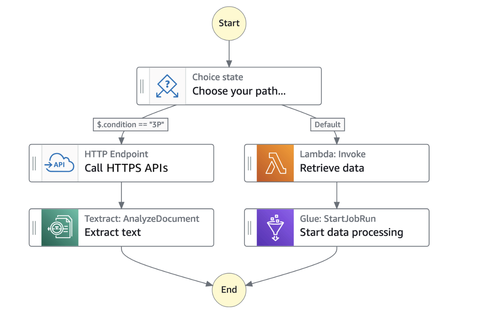
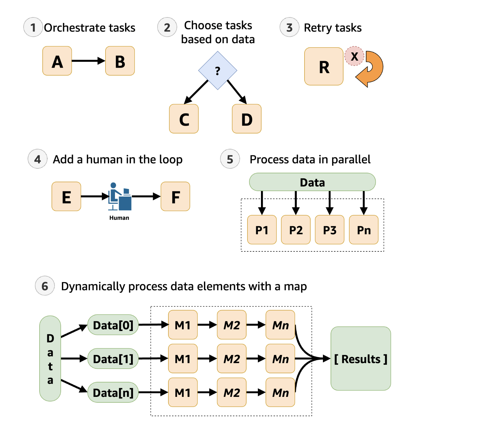
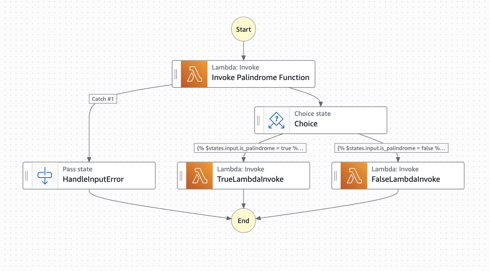
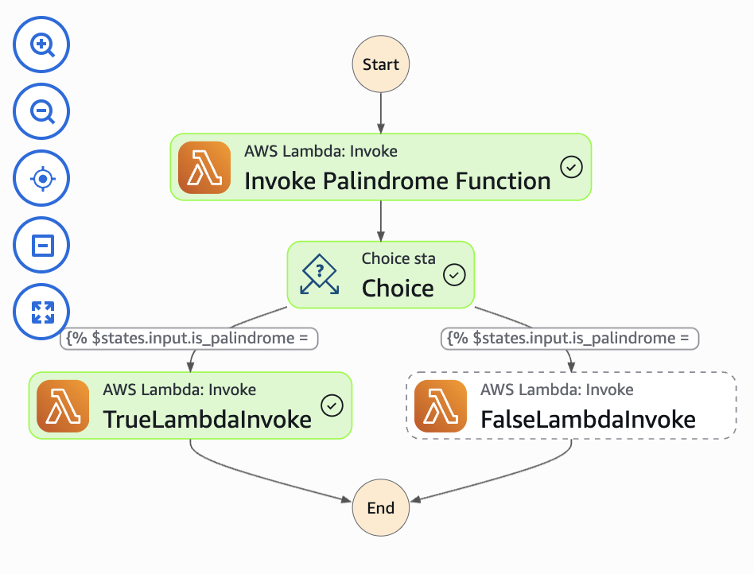
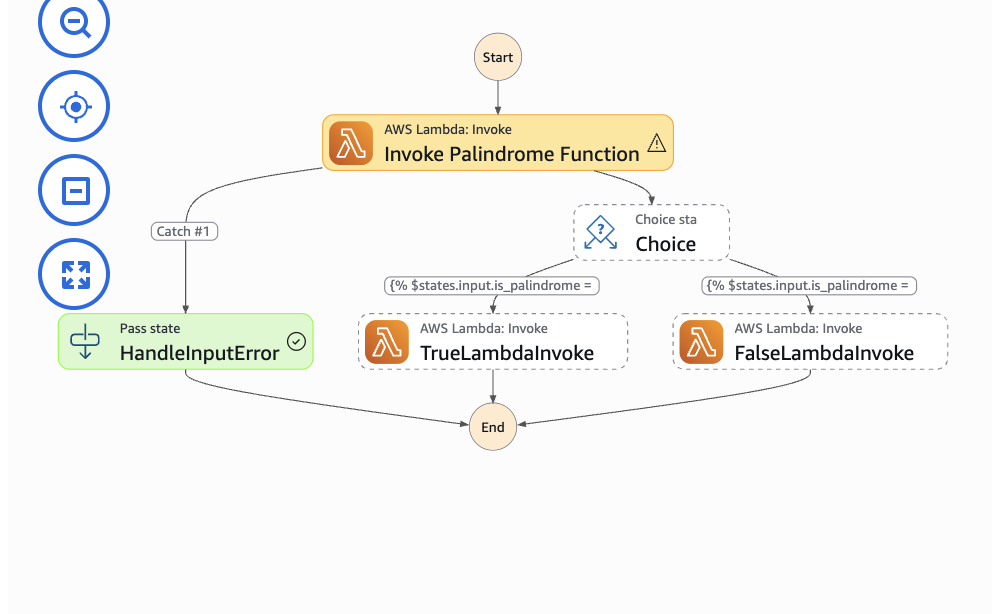

## Step Functions: an overview
- With the help of step functions, you can create workflows (or **state machines**) which are essentially a series of steps. Each step is called a **state**, and resembles a unit of work. For example, a **task state** is a unit of work that another AWS service (such as lambda/ec2) performs. 
- The instances of running workflows performing tasks are called **executions**.
- Each step can pass data to subsequent steps using variables and state output.
- **Workflows:** **standard** (support request and response. Some services support .sync and .waitForTaskToken) and **express** (only supports request response). 
- **Service Integration Patterns:** 
  a) **Request and response (default)** - AWS service called and step function waits till http response to progress to the next state.
  b) **Run a job (.sync)** - waiting for the job to complete.
  c) **Wait for a callback from task token (.waitForTaskToken)** - the step function waits till the task token is returned.


**Example use-cases of workflows:**



## Lambda: an overview
- It is a **serverless computing service** provided by AWS. Users can create functions/ self-contained applications, upload them to lambda which takes care of execution in an efficient and flexible manner. 
- "serverless" -> does not indicate there is no server used in the execution of the task. It just means that the service is fully managed -> the networking, operating system, hardware are all managed by AWS for users to focus on the application code writing. 
- Each lambda function runs in its own container. When a function is created, it gets packaged into a container which then runs on a multi-tenant cluster of machines AWS manages. Each container gets assigned the necessary RAM and CPU capacity. Once the execution is finished, the RAM assigned at the beginning is multiplied with the amount of time the function was in execution for and accordingly the customer is billed. 
- Many instances of the same functions, or multiple different functions can be executed concurrently at the same time, which is one of the distinctive properties of AWS Lambda. 

## Problem Statement
##### Design an AWS Step Functions state machine that accepts an input, passes it to a first Lambda function and returns a boolean result, feeds that boolean output into a Choice state to branch execution, and invokes a second Lambda function with two different response paths depending on the true or false outcome — while ensuring the original input remains accessible to all downstream states throughout the execution.

### Step 1: Create the first lambda function 
- Navigate to AWS Lambda.
- Create a function (for example, one that checks if a string is a palindrome or not).
- Deploy the function and ensure the input is properly handled in the function. 
- Run some test cases to see if the function is executing as expected. 
- Ensure the output is a string boolean value. A normal boolean value can be passed as output, but it is harder for the choice state to process. 

### Step 2: Create the second lambda function 
- Create the second step function that deals with string boolean inputs. 
- Deploy the function and run test cases to see if the function is executing as expected. 

### Step 3: Create the step function 
- Navigate to AWS Step Functions 
- Map out the design in this manner:
  
- Enter the aws lambda arn, along with the function name. The same boolean function is passed for TrueLambdaInvoke and FalseLambdaInvoke.
- Ensure the output concatenates the boolean result as well as the input string. This ensures that the input passed in the first state persists all the way to the end. 
- Create a new state (Pass state) that handles any error in input. 
- Define your choice state with two rules:
  ```
  "Choices": [
        {
          "Next": "TrueLambdaInvoke",
          "Condition": ""
        },
        {
          "Next": "FalseLambdaInvoke",
          "Condition": ""
        }
      ]
  ```

### Step 4: Create the workflow
- Create the workflow
- An IAM role to execute the AWS Lambda function automatically gets created and attached to the step function. 
- Run executions with different inputs. 

## Outputs:
### Case 1: Palindrome Pass

**Input: **
```
{
  "string": "racecar"
}
```

**Output: **
```
{
  "statusCode": 200,
  "body": {
    "message": "This is a palindrome, yay!",
    "string": "racecar"
  }
}
```

### Case 2: Palindrome Fail

**Input: **
```
{
  "string": "madamoiselle"
}
```

**Output:**
```
{
  "statusCode": 200,
  "body": {
    "message": "Sorry, not a palindrome",
    "string": "madamoiselle",
    "reverse": "ellesiomadam"
  }
}
```

### Case 3: Input error 

**Input:**
```
{
  "strong": "hello"
}
```

**Output:**
```
{
  "statusCode": 400,
  "error": "Invalid input",
  "message": "Missing or invalid 'string' field in input"
}
```


